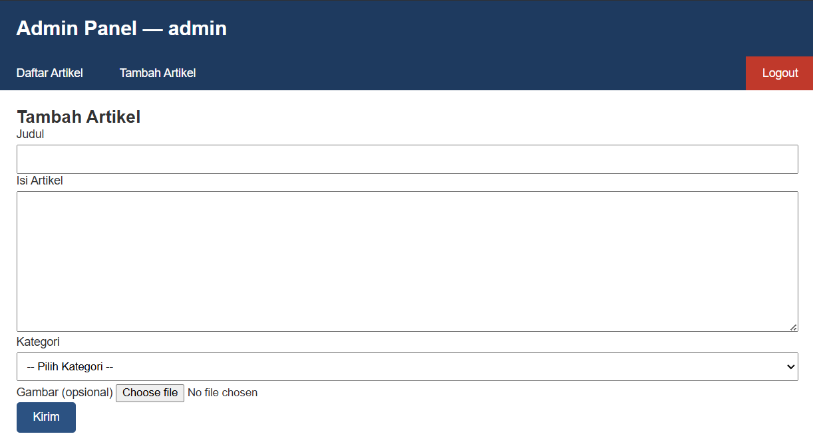

# Praktikum 7 Upload File Gambar
## NAMA: Albhani Fadillah Haryady
## NIM: 312410130


## Tujuan


Memahami konsep dasar File Upload.
Membuat fitur upload gambar menggunakan Framework CodeIgniter 4.


Langkah-langkah

1. Memodifikasi Method add() pada Controller Artikel

Menambahkan logika untuk memproses file upload dan memindahkan file ke direktori public/gambar.

```php
public function add()
{
    $validation = \Config\Services::validation();
    $validation->setRules(['judul' => 'required']);
    $isDataValid = $validation->withRequest($this->request)->run();

    if ($isDataValid) {
        $file = $this->request->getFile('gambar');
        $file->move(ROOTPATH . 'public/gambar');

        $artikel = new ArtikelModel();
        $artikel->insert([
            'judul'  => $this->request->getPost('judul'),
            'isi'    => $this->request->getPost('isi'),
            'slug'   => url_title($this->request->getPost('judul')),
            'gambar' => $file->getName(),
        ]);
        return redirect('admin/artikel');
    }
    $title = "Tambah Artikel";
    return view('artikel/form_add', compact('title'));
}
```
2. Memodifikasi View form_add.php

Menambahkan field input file dan mengubah atribut form menjadi enctype="multipart/form-data".

```html
<form action="" method="post" enctype="multipart/form-data">
    ...
    <p>
        <input type="file" name="gambar">
    </p>
</form>
```
